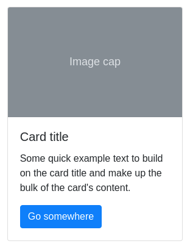

Карточки
===

Вам необходимо реализовать компонент карточек, позволяющий использовать себя следующим образом:

В качестве CSS вы можете использовать Bootstrap, а подглядеть генерируемую разметку можете на [странице]( https://getbootstrap.com/docs/4.3/components/card/).

Подсказка: используйте для этого `props.children` и `props` для отображения картинки.
